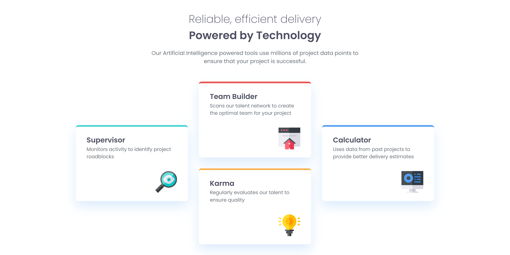

# Frontend Mentor - Four Card Feature Section

This is my solution to the [Four Card Feature Section Master challenge](https://www.frontendmentor.io) on Frontend Mentor.

## 📸 Screenshot

## 📍 Overview

A responsive layout built with **HTML** and **CSS**, featuring four cards with distinct border colours. The design adapts to different screen sizes, from mobile to desktop.

## 🛠 Built With

- HTML5
- CSS3 (Flexbox & CSS Grid)
- Mobile-first workflow
- Google Fonts (Poppins)

## 📂 Features

- Fully responsive design
- Clean and semantic HTML
- Simple, modern CSS styling
- Card layout changes based on screen size

## 🚀 Live Demo

[View Live Site](https://telmomanduco.github.io/four-card-feature-section-master/)

## 📄 Licence

This project is open source and free to use.
